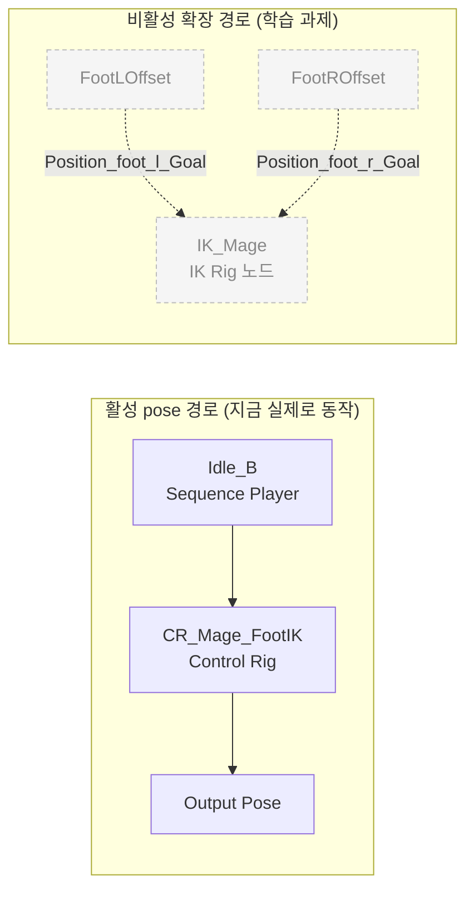
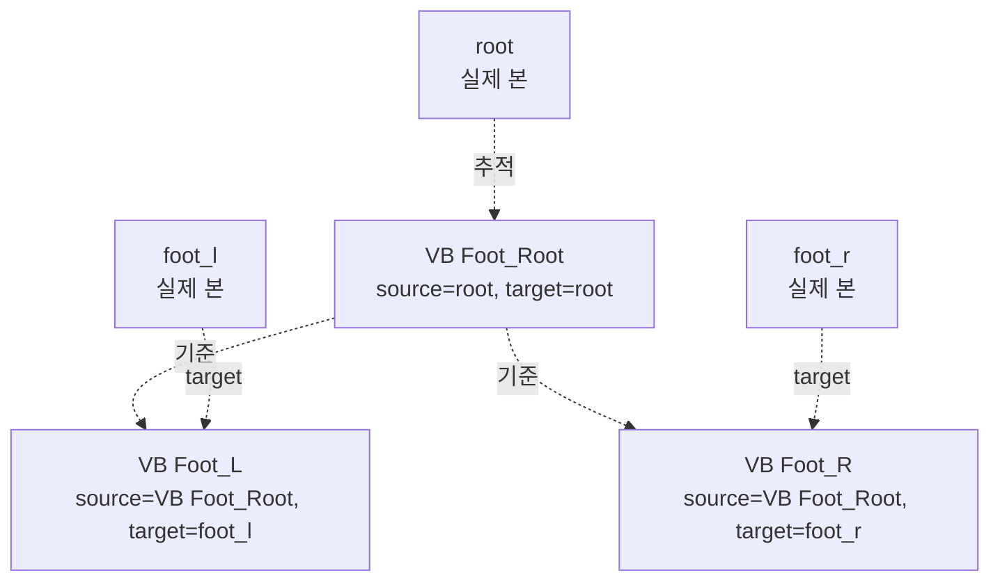
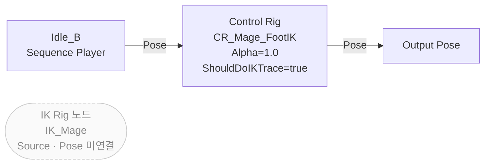
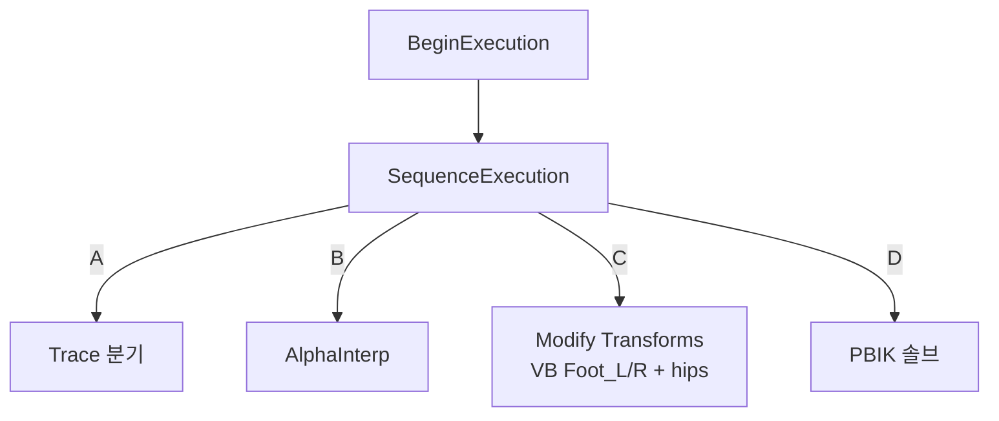
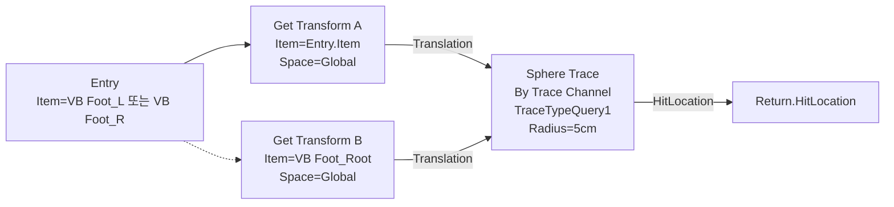
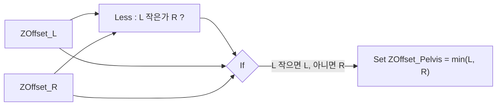
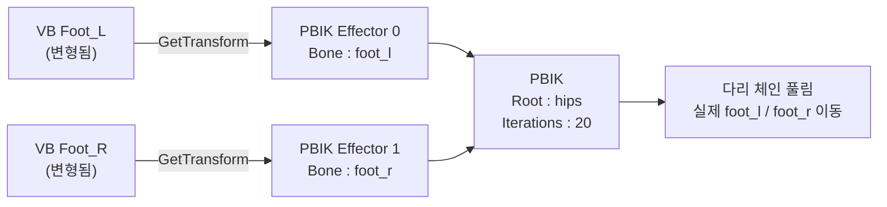

# Foot Placement — Learning

> **이 문서의 위치 (Diataxis: tutorial + explanation)**
> - 처음 본 사람이 멘탈 모델을 형성하는 것이 목표.
> - 모든 노드/핀/파라미터 전체 표는 `FootPlacement_ImplementationReference.md`.
> - 결함·해결책·확장 과제는 `FootPlacement_Troubleshooting.md`.
>
> **라벨 표기 규약** — 본문 곳곳에 등장
> - `{검증됨}` Monolith / 에디터에서 직접 측정한 사실
> - `{추론}` 측정값에서 해석한 의미
> - `{주의}` 현재 동작상의 위험 또는 버그 후보
> - `{확장}` 지금은 비활성이지만 학습 과제로 살릴 수 있는 경로

---

## 0. 이 문서를 읽고 나면

다음 5 가지를 자기 말로 설명할 수 있어야 한다.

1. **가상 본**(Virtual Bone)이 Foot Placement 에서 어떤 역할을 하는가
2. ABP_Mage 의 **활성 pose 경로** 가 무엇인가, 왜 그것만 평가되는가
3. Control Rig 내부 함수 **`FootTrace` 의 입력/출력**과 트레이스가 가는 방향
4. **PBIK 이펙터** 가 어떤 본을 어디로 끌어당기는가
5. **IK Rig(`IK_Mage`) 경로가 현재 비활성인 이유** 와 살리는 데 필요한 두 가지 연결

---

## 1. 한 화면 요약

한 줄 정리

> **가상 본 = “발의 목표 위치 마커”. PBIK = “그 마커로 실제 발 본을 끌어당기는 솔버”.**
> Foot Placement 의 핵심 아이디어는 이 두 문장 안에 다 있다.

`{검증됨}` 활성 경로는 `Idle_B → Control Rig → Output Pose` 단일 체인. `{검증됨}` `IK Rig` 노드는 그래프에 떠 있지만 `Source/Pose` 가 미연결이라 평가되지 않음.

---

## 2. 선행 개념 — 한 단락씩

이 다섯 가지를 알면 본문이 자연스럽게 읽힌다.

| 개념                | 한 단락 요약                                                                                                  |
|---------------------|---------------------------------------------------------------------------------------------------------------|
| **AnimGraph vs EventGraph** | AnimGraph 는 매 프레임 “pose 를 만드는” 시각적 데이터 흐름. EventGraph 는 일반 BP 처럼 이벤트→로직→변수 설정. ABP 안에 두 그래프가 공존하며 “변수 갱신은 EventGraph, 갱신된 변수를 읽어 pose 합성은 AnimGraph” 가 일반 패턴. |
| **Virtual Bone**    | 스켈레톤에 추가 가능한 “가짜 본”. source 본의 위치에 매달려, target 본까지의 상대 트랜스폼을 자동 노출. 메시 스킨 가중치가 없어 추가/제거가 무손실. IK/Control Rig 가 “일반 본” 처럼 다룰 수 있다. |
| **GlobalSpace / AdditiveGlobal** | `GetTransform(..., GlobalSpace)` 는 본의 월드 트랜스폼을 읽음. `ModifyTransforms(..., Mode=AdditiveGlobal)` 는 기존 글로벌 트랜스폼에 **더한다** — 즉 입력값이 _델타_ 로 해석됨. (이 단위 해석 차이가 §주의 포인트로 이어진다.) |
| **IK Goal / Effector** | IK 시스템에서 “여기로 본을 끌어와라” 의 목적지 지정. IK Rig 의 Goal, Control Rig PBIK 의 Effector 가 같은 개념. 핵심 입력은 “어느 본을 / 어떤 트랜스폼으로 끌어올지”. |
| **PBIK vs FBIK**    | FBIK(Full Body IK) 는 IK Rig 의 솔버 타입. PBIK(Position-Based IK) 는 Control Rig 의 `RigUnit_PBIK` 노드. 알고리듬은 다르지만 “골/이펙터 → 본 체인을 풀어 본을 그쪽으로 보낸다” 는 본질이 같다. |

---

## 3. 가상 본 — Foot Placement 의 첫 단추

### 3.1 무엇인가

가상 본은 스켈레톤에 추가하는 “가짜 본”. **source 본의 위치에 매달려, target 본까지의 상대 트랜스폼을 자동 추적**한다. 메시 스킨 가중치가 없으므로 추가/제거가 메시·기존 애니메이션·리타게팅을 깨지 않는다.

추가 방법: Skeleton 에디터에서 source 본 우클릭 → **Add Virtual Bone** → target 본 선택. 자동으로 `VB ` 접두사가 붙고 이름을 자유롭게 바꿀 수 있다.

### 3.2 본 프로젝트의 3개

| 가상 본          | 역할 (한 줄)                                                |
|------------------|-------------------------------------------------------------|
| `VB Foot_Root`   | 캐릭터 루트(= 캡슐 바닥) 위치를 **지면 영점** 이라는 의미로 노출 |
| `VB Foot_L`      | 왼발의 월드 위치를 “지면 영점 기준” 으로 표현                |
| `VB Foot_R`      | 오른발의 월드 위치를 “지면 영점 기준” 으로 표현              |

### 3.3 왜 필요한가 — 3 문장

1. 발 본 `foot_l/r` 을 **직접** 옮기면 무릎/허벅지와 끊긴 느낌이 난다 → 별도 “목표 위치 마커” 가 필요하다.
2. 마커를 일반 본으로 만들면 메시·리타게팅이 깨진다 → **가상 본** 이 정답이다 (스킨 가중치 없음).
3. 마커를 옮기는 단계와 “마커를 따라 실제 발을 푸는” IK 단계가 분리되어 **디버그·교체가 쉬워진다** (PBIK ↔ FBIK 갈아끼우기 가능).

:::verify
**확인해 보기 — 가상 본의 존재**
- Mage_Skeleton 에디터 열기 → 본 트리에서 `VB Foot_Root`, `VB Foot_L`, `VB Foot_R` 3 개가 보이는가?
- Monolith: `mcp__monolith__animation_query / get_skeleton_info(asset_path="/Game/Characters/Mage/SkeletalMeshes/Mage_Skeleton")` 의 `virtual_bones` 필드에 3 개가 출력되는가?
:::

---

## 4. 활성 pose 경로 — 지금 실제로 평가되는 것

| 항목              | 값                                                                                       |
|-------------------|------------------------------------------------------------------------------------------|
| 평가되는 노드 수  | 3 (SequencePlayer → ControlRig → Output Pose)                                            |
| 그래프 전체 노드 수 | 6 (위 3 + IK Rig 1 + VariableGet 2)                                                       |
| `ControlRig.Alpha` | 1.0 (상수)                                                                                |
| `ControlRig.ShouldDoIKTrace` | `true` (상수, 미연결)                                                            |
| `IK Rig.Source/Pose` | 미연결 — 평가되지 않음                                                                 |

`{추론}` IK Rig 노드의 Position Goal 핀이 `FootLOffset/FootROffset` 변수에 연결되어 있는데도 평가되지 않는 이유는 “포즈 입출력이 안 이어졌기” 때문이다. 즉 이 노드 자체가 그래프에서 “외딴 섬” 이다.

`{확장}` 이 외딴 섬을 살리는 방법은 `Troubleshooting.md` §5 의 단계별 절차를 참고.

:::verify
**확인해 보기 — 활성 경로**
- ABP_Mage 의 AnimGraph 를 열어 `Output Pose` 의 입력을 따라가면 `Control Rig → Sequence Player(Idle_B)` 만 만난다.
- IK Rig 노드의 `Source` / `Pose` 핀이 어디에도 연결되지 않은 것을 시각적으로 확인.
- Monolith: `mcp__monolith__blueprint_query / get_graph_data(asset_path="/Game/CustomFootIK/ABP_Mage", graph_name="AnimGraph")` 응답에서 IK Rig 노드의 두 PoseLink 핀이 `connected_to: []` 인지 확인.
:::

---

## 5. Control Rig 4 단계 — A · B · C · D

`BeginExecution → SequenceExecution` 이 4 갈래(A/B/C/D)를 순차 실행한다.

각 단계는 **목적 → 입력 → 주요 노드 → 출력 → 검증 → 주의** 6 칼럼 표로 일관되게 본다.

### 5.1 단계 A — 트레이스로 raw 목표 Z 구하기

| 항목     | 내용                                                                                                       |
|----------|------------------------------------------------------------------------------------------------------------|
| 목적     | 양 발 위치에서 “지면이 어디인가” 의 raw 값을 얻는다.                                                       |
| 입력     | `ShouldDoIKTrace` (bool 변수)                                                                              |
| 주요 노드 | `Variable Get(ShouldDoIKTrace)` → `RigVMFunction_ControlFlowBranch` → `FootTrace(VB Foot_L)`, `FootTrace(VB Foot_R)` |
| 출력     | `ZOffset_L_Target`, `ZOffset_R_Target` (double 변수)                                                       |
| 검증     | Monolith: `get_control_rig_graph` 의 노드들 중 `RigVMFunction_ControlFlowBranch` 의 `True` 분기가 `FootTrace.ExecuteContext` 로 이어지는지 |
| 주의     | `{주의}` `False` 분기의 Setter 두 개는 Value 핀이 미연결 → RigVM 기본값 0 이 쓰임. “트레이스 끄면 타깃 0” 이 의도된 동작. |

`FootTrace` 함수 본체:

- Start: 발 가상 본 월드 위치 / End: `VB Foot_Root` 월드 위치 (=캐릭터 루트, 보통 발바닥 평면).
- 호출자는 반환값의 **Z 성분만** 추출해 `ZOffset_*_Target` 에 set 한다.

### 5.2 단계 B — 보간으로 부드럽게

| 항목     | 내용                                                                              |
|----------|-----------------------------------------------------------------------------------|
| 목적     | raw 목표값을 시간축에서 매끄럽게 따라가 발이 떨림 없이 지면을 잡고/놓는다.        |
| 입력     | `ZOffset_L_Target`, `ZOffset_R_Target`                                            |
| 주요 노드 | `RigVMFunction_AlphaInterp` 2 개 (좌·우)                                          |
| 출력     | `ZOffset_L`, `ZOffset_R`                                                          |
| 검증     | 두 보간기의 `InterpSpeedIncreasing` / `InterpSpeedDecreasing` 가 모두 15 인지     |
| 주의     | `bMapRange` / `bClampResult` 가 false. 입력값이 매우 클 때 클램프가 없음.         |

### 5.3 단계 C — 가상 본과 펠비스를 옮긴다

| 항목     | 내용                                                                                                                |
|----------|---------------------------------------------------------------------------------------------------------------------|
| 목적     | “이만큼 위/아래로 가야 한다” 는 양을 가상 본 두 개와 펠비스에 글로벌 델타로 적용한다.                              |
| 입력     | `ZOffset_L`, `ZOffset_R`                                                                                            |
| 주요 노드 | `ModifyTransforms`(`VB Foot_L`, AdditiveGlobal), `ModifyTransforms_1`(`VB Foot_R`), `Less` + `If` (펠비스 산출), `ModifyTransforms_2`(`hips`) |
| 출력     | 변형된 `VB Foot_L/R` 의 월드 트랜스폼 + 내려간/올라간 `hips`                                                        |
| 검증     | Monolith: `ModifyTransforms*` 3 개의 `Item.Name` 이 각각 `VB Foot_L`, `VB Foot_R`, `hips` 인지                       |
| 주의     | `{주의}` AdditiveGlobal 은 입력을 **델타** 로 본다. `FootTrace.HitLocation.Z` 는 **월드 절대 좌표** → 단위 불일치 (Troubleshooting §2). |

펠비스 계산:

`{추론}` “더 낮은 발 쪽으로 펠비스를 같이 내려서, 다른 발이 떠 보이지 않게” 만드는 표준 펠비스 보정 패턴이다.

### 5.4 단계 D — PBIK 가 실제 다리를 푼다

| 항목     | 내용                                                                                                       |
|----------|------------------------------------------------------------------------------------------------------------|
| 목적     | C 에서 옮긴 “목표 마커(VB Foot_L/R)” 의 월드 위치로 실제 `foot_l/r` 본이 가도록 다리 체인을 푼다.          |
| 입력     | `GetTransform(VB Foot_L, GlobalSpace)`, `GetTransform(VB Foot_R, GlobalSpace)` 두 트랜스폼                  |
| 주요 노드 | `RigUnit_PBIK` (Root=`hips`, Iterations=20, RootBehavior=`PinToInput`)                                     |
| 출력     | 변형된 다리 체인 (실제 본 트랜스폼)                                                                         |
| 검증     | Monolith: `PBIK.Effectors[0].Bone`=`foot_l`, `PBIK.Effectors[1].Bone`=`foot_r` 인지 / `Root`=`hips` 인지   |
| 주의     | `RootBehavior=PinToInput` 이라 PBIK 가 풀 때 펠비스는 “이미 옮긴 자리에 고정”. C 단계 펠비스 보정과 정확히 맞물려야 자연스럽다. |

:::verify
**확인해 보기 — 4 단계 통째로**
- Control Rig 에디터의 Rig Hierarchy 에서 PIE 중 `VB Foot_L/R` 의 Z 가 0 이 아닌 값으로 흔들리는가?
- `foot_l/r` 본이 같은 방향으로 따라가는가?
- `hips` Z 도 같이 움직이는가?
- Monolith: `get_control_rig_variables` 로 `ZOffset_L/R/_Target/Pelvis` 값이 0 이 아닌지 (실행 중 한정).
:::

---

## 6. 검증 체크리스트 (학습 마무리용)

다 끝났으면 다음을 자기 손으로 확인해 보자.

| # | 확인 항목                                                                                  | 어디서                                              |
|---|---------------------------------------------------------------------------------------------|-----------------------------------------------------|
| 1 | `Mage_Skeleton` 에 가상 본 3 개가 있다                                                      | Skeleton 에디터 / Monolith `get_skeleton_info`      |
| 2 | `ABP_Mage` AnimGraph 의 활성 경로는 3 노드만이다 (IK Rig 노드는 외딴 섬)                    | AnimGraph 시각 확인 / Monolith `get_graph_data`     |
| 3 | `CR_Mage_FootIK` 의 `SequenceExecution` 4 갈래가 A/B/C/D 순으로 이어진다                    | Control Rig 에디터 / Monolith `get_control_rig_graph` |
| 4 | `FootTrace` 함수가 `VB Foot_L/R → VB Foot_Root` 방향으로 Sphere Trace 한다                  | Control Rig 함수 그래프                              |
| 5 | `ModifyTransforms` 3 개의 타깃 본이 `VB Foot_L` / `VB Foot_R` / `hips` 다                   | Control Rig 에디터                                   |
| 6 | `PBIK` 의 두 이펙터가 `foot_l` / `foot_r` 이고, 각 Transform 입력이 위 GetTransform 와 이어진다 | Control Rig 에디터                                   |
| 7 | EventGraph 의 `BlueprintUpdateAnimation.then` 핀이 비어 있다 (현재 데드 체인)                | EventGraph 시각 확인 / Monolith `get_graph_data(EventGraph)` |
| 8 | `TraceTypeQuery1` 이 프로젝트 설정에서 어떤 채널인지                                        | Project Settings → Engine → Collision               |

---

## 7. 다음에 읽을 문서

- **`FootPlacement_Troubleshooting.md`** — 위에서 `{주의}` 로 표시된 항목들(단위 불일치, 데드 체인, 트레이스 채널, HitNormal 미사용) 을 “증상 → 원인 → 해결 → 확인” 으로 풀어 둔다. 그리고 IK Rig 경로를 살리는 단계별 절차도 여기에 있다.
- **`FootPlacement_ImplementationReference.md`** — 위의 모든 노드/핀/파라미터 표를 단일 SSOT 로 모아 둔다. “정확한 값이 궁금할 때” 만 펴 보면 된다.
