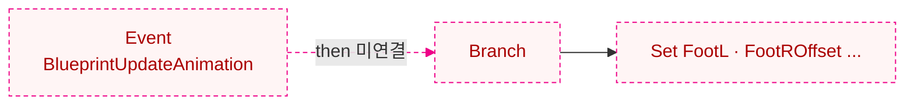
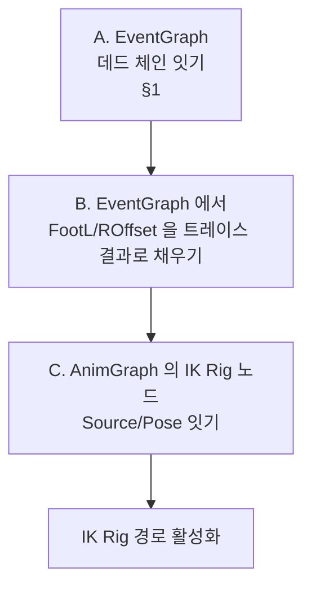

# Foot Placement — Troubleshooting & Extensions

> **이 문서의 위치 (Diataxis: how-to + explanation)**
> - 학습 본문은 `FootPlacement_Learning.md`
> - 모든 노드/핀/파라미터 표는 `FootPlacement_ImplementationReference.md`
> - 본 문서는 “지금 정확히 무엇이 문제이고, 어떻게 고치며, 무엇을 확장할 수 있는가” 만 다룬다.
>
> **각 항목 공통 형식**
> 1. **증상** — 사용자가 PIE/뷰포트에서 보거나, Monolith 로 측정해 잡을 수 있는 사실
> 2. **원인** — 측정값에서 따라오는 원인 해석
> 3. **해결 또는 확장** — 구체적 단계
> 4. **확인** — 고친 뒤 무엇으로 검증하는지

라벨 표기 규약은 `FootPlacement_Learning.md` 와 동일: `{검증됨}` `{추론}` `{주의}` `{확장}`.

---

## 1. EventGraph 데드 체인 — 변수 갱신이 한 번도 실행되지 않는다

### 1.1 증상

- `{검증됨}` `ABP_Mage` 의 `EventGraph` 는 **10 개 노드** 가 있다.
- `{검증됨}` 그러나 `Event Blueprint Update Animation` 의 `then` (exec) 출력 핀이 어디에도 연결되어 있지 않다.
- 결과: 그 아래의 `Try Get Pawn Owner → Get Movement Component → Is Falling → NOT → Branch → Set FootL/ROffset…` 라인이 매 프레임 시작되지 않는다.



### 1.2 원인

블루프린트의 함수형 노드(`Try Get Pawn Owner`, `Is Falling`, `NOT` 등) 는 **출력 핀이 연결되면 알아서 평가**되지만, `Set Variable` 같은 부수효과 노드는 **exec 핀이 흘러야** 실행된다. 시작점인 `Event BlueprintUpdateAnimation.then` 이 비어 있으니, 전체 exec 체인이 출발하지 못한다.

> `Branch.Condition` 입력은 정상적으로 `NOT(IsFalling)` 결과를 받지만, `Branch.execute` 가 비어 있어 분기 자체가 평가되지 않는다.

### 1.3 해결 — exec 라인 잇기

1. `Event Blueprint Update Animation.then` 출력 핀에서 드래그 → `Branch.execute` 입력 핀에 연결.
2. 컴파일 → PIE 실행.
3. 의도가 분명하다면 두 분기의 값도 정리:
   - 지상(`NOT IsFalling == true`) 분기는 “트레이스/오프셋 정상 적용” 의도일 것이므로, 임시값 `(0,0,20)` 같은 디버그 상수를 빼고 실제 트레이스 결과(또는 Control Rig 의 `ZOffset_*`) 와 동기화하는 코드를 둔다.
   - 공중(`else`) 분기는 두 오프셋을 `(0,0,0)` 으로 리셋.

### 1.4 확인

- `mcp__monolith__blueprint_query / get_graph_data(asset_path="/Game/CustomFootIK/ABP_Mage", graph_name="EventGraph")` 응답에서 `K2Node_Event_0.then` 의 `connected_to` 가 비어 있지 않음.
- PIE 중 변수 워치로 `FootLOffset/FootROffset` 가 매 프레임 갱신되는지 (현재는 한 번도 갱신 안 됨).

`{주의}` 단, EventGraph 의 setter 들이 “채워야 할 변수” `FootLOffset/FootROffset` 는 IK Rig 노드 핀에만 연결되어 있고, IK Rig 노드는 §5 에서 다루듯 별도로 살려 두지 않으면 평가되지 않는다. **데드 체인을 잇는 것만으로는 IK 가 켜지지 않는다.**

---

## 2. `HitLocation.Z` 절대값을 AdditiveGlobal 델타처럼 쓴다

### 2.1 증상

- `{검증됨}` `FootTrace.HitLocation.Z` 는 월드 절대 Z 좌표.
- `{검증됨}` 이 값이 그대로 `ZOffset_*_Target` → `AlphaInterp` → `ModifyTransforms(VB Foot_L/R, Translation.Z=ZOffset_*, Mode=AdditiveGlobal)` 에 들어간다.
- AdditiveGlobal 모드는 입력을 **델타(글로벌에 더하는 양)** 로 본다.
- 결과: 캐릭터가 월드 Z=0 평지에 있을 때만 우연히 옳고, 언덕(world Z ≠ 0) 위에서는 발이 의도와 다르게 떠 오르거나 가라앉는다.

### 2.2 원인

단위 의미가 두 단계 사이에서 어긋나 있다.

- 트레이스의 의도: “지면이 어디인가” → **절대 좌표** 가 자연스러움
- ModifyTransforms 의 의도: “기존 본 위치에서 얼마나 옮길까” → **델타**

### 2.3 해결 — 트레이스 결과를 델타로 환산

A 단계의 `FootTrace` 호출 직후, “원래 발 가상 본의 월드 Z 와의 차이” 를 만들어 `ZOffset_*_Target` 에 넣는다.

```
ZOffset_L_Target = HitLocation.Z  -  GetTransform(VB Foot_L,    GlobalSpace).Translation.Z
ZOffset_R_Target = HitLocation.Z  -  GetTransform(VB Foot_R,    GlobalSpace).Translation.Z
```

또는 `VB Foot_Root.Z` 를 기준점으로 잡고 발이 그 위로 얼마나 올라가야 하는지로 환산해도 된다.

`{확장}` 더 깔끔하게는 `FootTrace` 함수의 반환값을 “이미 델타로 환산된 스칼라” 로 바꿔 두면 호출자 측이 단순해진다.

### 2.4 확인

- 캐릭터를 world Z=200 인 플랫폼 위로 옮긴 뒤, `ZOffset_L/R` 값이 0 근방인지 (지면이 평탄하면 0 이어야 정상).
- 언덕에 세웠을 때 한쪽 발은 음수(`디딘 쪽`), 다른 쪽은 0 또는 작은 값이어야 정상.

---

## 3. `TraceTypeQuery1` 의존 — 프로젝트 콜리전 채널 의존성

### 3.1 증상

- `{검증됨}` `FootTrace` 의 `Sphere Trace By Trace Channel` 노드 `TraceChannel = TraceTypeQuery1`.
- 프로젝트 콜리전 설정상 `TraceTypeQuery1` 은 기본 **Visibility** 채널.
- Visibility 를 막는/투과하는 콜리전 설정이 있는 액터(예: 점프대 트리거, 일부 SM_Plane) 에서는 트레이스 결과가 부정확해질 수 있다.

### 3.2 원인

“Foot IK 전용” 채널이 따로 정의되지 않아 시각 검사 채널과 충돌한다.

### 3.3 해결 — 전용 채널 분리

1. Project Settings → Engine → **Collision** → **Trace Channels** → **New Trace Channel**
   - Name: `FootIK`
   - Default Response: `Block`
2. 지면 메시들의 콜리전 프리셋에서 `FootIK` 응답을 `Block`, 트레이스에 잡히지 않아야 하는 액터는 `Ignore` 로 설정.
3. `CR_Mage_FootIK` 의 `FootTrace` 함수 그래프에서 `Sphere Trace By Trace Channel` 의 `TraceChannel` 핀을 새 `TraceTypeQuery*` (= FootIK 가 매핑된 enum) 로 변경.

### 3.4 확인

- Project Settings 의 Trace Channels 목록에 `FootIK` 가 있고, 각 enum 번호 확인.
- Control Rig 의 SphereTrace 노드 `TraceChannel` 값이 `FootIK` 매핑값으로 표시.
- 점프대/트리거 위에서 Foot IK 가 더이상 그 액터에 부딪히지 않는지 PIE 로 검증.

---

## 4. `HitNormal` 미사용 — 발이 지면 노멀을 따라 기울지 않는다

### 4.1 증상

- `{검증됨}` `FootTrace` 의 `SphereTraceByTraceChannel.HitNormal` 출력 핀이 어디에도 연결되어 있지 않다.
- `{검증됨}` `ModifyTransforms(VB Foot_L/R)` 는 Translation 만 만지고 Rotation 은 디폴트(quat identity) 그대로.
- 결과: 캐릭터가 경사면에 섰을 때 발 위치는 보정되지만 발바닥이 지면 기울기를 따라가지 않는다.

### 4.2 원인

지면 노멀 정보(`HitNormal`)를 가상 본 회전 단계로 전달하는 코드가 없다.

### 4.3 해결 — 가상 본 회전을 노멀로 보정

1. `FootTrace` 함수의 반환을 확장: `HitLocation` 외에 `HitNormal` 도 함께 반환 (또는 별도 변수 `Normal_L/R` 도입).
2. C 단계의 `ModifyTransforms(VB Foot_L/R)` 에서 `Transform.Rotation` 도 함께 set:
   - 발의 “Up” 축을 `HitNormal` 에 정렬하고, 캐릭터 forward 를 기준 축으로 잡는 회전 산출 (`MakeRotFromZX(HitNormal, CharacterForward)` 등).
   - Mode 를 `AdditiveGlobal` 대신 `OverrideGlobal` 로 두거나, 회전만 따로 처리하는 `RigUnit_SetRotation` 류 노드를 추가.
3. PBIK 이펙터의 `RotationAlpha` 는 이미 1.0 → 가상 본 회전이 그대로 발 회전으로 풀린다.

`{확장}` 노멀 보정을 너무 강하게 주면 캐릭터가 가파른 슬로프에서 발이 휘청거리므로, `Lerp(현재 회전, 노멀 정렬 회전, 0.5)` 같이 강도 조절을 두는 편이 안전.

### 4.4 확인

- 경사면 메시 위에 캐릭터를 세우고 발이 지면을 따라 기우는지 PIE 로 확인.
- Control Rig 의 Rig Hierarchy 에서 `VB Foot_L/R` 의 Rotation 값이 변하는지.

---

## 5. IK Rig 경로 살리기 — 같은 가상 본 인프라로 또 한 가지 솔버 학습

### 5.1 현재 상태

- `{검증됨}` `ABP_Mage` AnimGraph 의 `IK Rig` 노드는 `Source/Pose` 가 미연결.
- `{검증됨}` IK Rig 노드의 Position Goal 핀은 `FootLOffset/FootROffset` 변수에 연결되어 있으나, EventGraph 가 데드 체인이라(§1) 변수 자체가 갱신되지 않음.
- `{검증됨}` `IK_Mage` 에셋 자체는 `IKRigFullBodyIKSolver` 1 개 + 4 개 골(`hand_l/r_Goal`, `foot_l/r_Goal`) 로 완전한 상태.

### 5.2 살리는 절차

세 갈래를 모두 처리해야 결과가 나온다.



#### A. EventGraph 데드 체인 잇기

§1.3 절차 적용.

#### B. `FootL/ROffset` 을 트레이스 결과로 채우기

EventGraph 에서 다음을 추가:

1. 매 `Update Animation` 마다 캐릭터 메시의 본 트랜스폼을 읽는다. (가장 깔끔한 길은 `Get Owning Component` → `Get Socket Transform`(`VB Foot_L`)).
2. 거기서 아래로 라인/스피어 트레이스 → `HitLocation` 의 Z (또는 발 원본 Z 와의 차이) 산출.
3. 결과를 `FVector(0, 0, deltaZ)` 형태로 `FootLOffset` 에 set. 우측도 동일.

`{확장}` 또는 EventGraph 가 아닌 C++ 에서 Tick 시 계산해 `FootLOffset/FootROffset` 변수에 푸시하는 방식도 가능 (ABP `AnimInstance` 의 `Get` 으로 직접 접근).

#### C. AnimGraph 의 IK Rig 노드 잇기

- `IK Rig.Source` 입력에 `Sequence Player(Idle_B)` 의 Pose 출력을 잇거나, `Control Rig` 출력 Pose 를 잇는다.
  - **Control Rig 와 직렬** 로 두면 “먼저 PBIK 가 풀고, 그 위에 IK Rig 가 다시 보정” 하는 형태. 두 솔버가 충돌할 수 있으므로 학습 비교용이라면 한쪽씩 분리해서 보는 편이 안전.
- `IK Rig.Pose` 출력을 `Output Pose.Result` 에 잇는다. 기존 `Control Rig.Pose → Output Pose` 연결은 끊는다.

### 5.3 확인

- AnimGraph 시각: `Output Pose` 가 `IK Rig` 의 결과를 받고 있음.
- Monolith: `get_graph_data(AnimGraph)` 응답에서 `AnimGraphNode_IKRig_0.Source` / `Pose` 의 `connected_to` 가 비어있지 않음.
- PIE 에서 IK Rig 의 `foot_l/r_Goal` 매니퓰레이터가 트레이스 결과를 따라가는지 IK Rig 디버그 그리기로 확인.

`{추론}` IK Rig 경로의 결과와 Control Rig 경로의 결과가 다를 수 있다 — 두 솔버의 알고리듬이 다르기 때문. 같은 가상 본 인프라로 두 결과를 비교해 보는 것 자체가 학습 가치가 크다.

---

## 6. 공중 상태에서 IK 비활성화

### 6.1 증상

- `{검증됨}` 현재 `ControlRig.ShouldDoIKTrace` 는 **상수 `true`** 로 고정.
- `{추론}` 점프/낙하 중에도 매 프레임 트레이스를 수행 → 발 아래에 지면이 없을 때 트레이스가 무엇을 잡든 발이 그쪽으로 끌려갈 가능성.

### 6.2 해결 — `ShouldDoIKTrace` 를 상태로 결정

1. ABP 에 `bDoIKTrace : bool` 변수 추가.
2. EventGraph `Blueprint Update Animation` 에서 `Pawn → Movement Component → IsFalling` 결과의 `NOT` 으로 set (=지상일 때만 true).
3. AnimGraph 의 `Control Rig` 노드 `ShouldDoIKTrace` 입력을 위 변수에 연결.

`{확장}` EventGraph 의 기존 노드 골격(`Try Get Pawn Owner → Get Movement Component → Is Falling → NOT`) 이 이미 있으므로, 새 변수 set 노드만 한 줄 추가하고 §1 의 exec 라인을 잇기만 하면 같은 데이터가 두 곳을 동시에 갱신할 수 있다.

### 6.3 확인

- 점프 중 `VB Foot_L/R`, `hips` 의 Z 변형이 0 으로 수렴하는지.
- AlphaInterp 의 속도(15/sec) 때문에 트레이스가 꺼져도 즉시는 0 이 안 되지만, 몇 프레임 안에 0 으로 부드럽게 떨어져야 정상.

---

## 7. 가상 본의 추가 활용 — “위치 마커” 너머

`{확장}` 본 시스템의 가상 본은 “위치 마커” 로 쓰이지만, 다음 두 가지도 같은 인프라 위에서 자연스럽게 확장된다.

| 확장 아이디어                                              | 어떻게                                                                                                  |
|------------------------------------------------------------|---------------------------------------------------------------------------------------------------------|
| 발 회전을 지면 노멀에 정렬                                  | §4 참고. `VB Foot_L/R` 의 회전을 `HitNormal` 로 보정 → PBIK 가 `RotationAlpha=1` 로 풀어준다.            |
| 발끝(`toes_l/r`) 별도 IK                                   | `VB Toe_L/R` 같은 가상 본을 추가하고, PBIK Effector 또는 두 번째 IK Goal 로 노출.                       |
| 손 IK (벽 짚기, 무기 잡기 등)                              | `hand_l/r_Goal` 은 이미 `IK_Mage` 에 존재. 가상 본 `VB Hand_L/R` 을 추가해 같은 패턴으로 위치 마커를 둘 수 있음. |

---

## 8. 변경 영향 요약

| 변경                          | 영향 범위                                            | 위험                                          |
|-------------------------------|------------------------------------------------------|-----------------------------------------------|
| EventGraph exec 연결 (§1)     | `FootL/ROffset` 가 매 프레임 갱신됨                  | IK Rig 노드가 살아 있지 않으면 효과 없음      |
| 트레이스 → 델타 환산 (§2)     | Control Rig 경로의 발 위치가 실제 지면에 맞춰짐      | 잘못 환산 시 발이 더 격렬하게 떨릴 수 있음   |
| 전용 트레이스 채널 (§3)       | 트레이스가 잡는 콜리전 범위 변경                     | 지면 메시 콜리전 프리셋도 같이 손봐야 함     |
| HitNormal → VB 회전 (§4)      | 경사면에서 발이 기울게 됨                            | 가파른 곳에서 발이 비현실적으로 휘청거릴 수 있음 |
| IK Rig 경로 활성화 (§5)       | Control Rig 와 IK Rig 두 솔버 결과 비교 가능         | 둘을 직렬 연결하면 결과가 누적/충돌 가능       |
| `ShouldDoIKTrace` 변수화 (§6) | 공중에서 IK 자동 꺼짐                                | EventGraph exec 라인 의존 (§1 선행)            |
